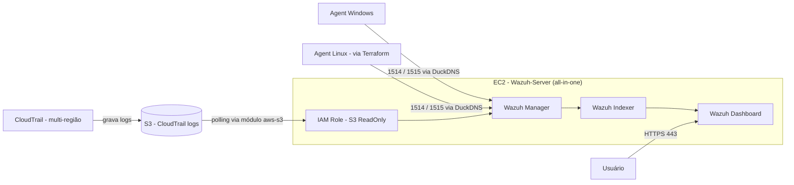

# Wazuh AWS SIEM

Laboratório de SIEM (Security Information and Event Management) usando **Wazuh**, hospedado na **AWS**, em formato **all-in-one** (manager + indexer + dashboard na mesma instância EC2).

Projeto de estudo/portfólio, parte da iniciativa **VV Cloud Security**.

📄 Quer o passo a passo completo, com troubleshooting real (disco cheio, certificado, IAM, IP dinâmico, FinOps)? Veja o registro de deploy em [`wazuh-deployment.md`](./wazuh-deployment.md).

## Índice

- [Destaques](#destaques)
- [Objetivo](#objetivo)
- [Arquitetura](#arquitetura)
- [Integração AWS](#integracao-aws)
- [Provisionamento](#provisionamento)
- [Segurança aplicada](#seguranca)
- [Débitos técnicos conhecidos](#debitos)
- [Próximos passos](#proximos)

## Destaques

- 🛠️ **Deploy real, não só tutorial**: SIEM all-in-one funcional na AWS, do zero ao agent monitorando eventos, com problemas reais resolvidos no caminho.
- 🔐 **Hardening aplicado, não só documentado**: TLS via Let's Encrypt, acesso restrito por IP em todas as portas sensíveis, chaves `ed25519` por máquina, segredos fora do Git.
- 🧱 **Primeira migração para IaC**: agent Linux provisionado via Terraform, com usuário/grupo IAM dedicado seguindo o princípio de least privilege.
- 🧾 **Consciência de custo (FinOps)**: custo acompanhado via AWS Cost Explorer, instância parada manualmente quando ociosa.
- ☁️ **Integração de nuvem funcionando de ponta a ponta**: CloudTrail → S3 → Wazuh validado com teste real (não só configurado), aproveitando as regras nativas de compliance (GDPR, HIPAA, PCI-DSS, NIST) já embutidas no Wazuh.
- 📚 **Troubleshooting documentado**: cada problema real (disco cheio, certificado não aplicando, IAM, `terraform destroy` acidental, IP dinâmico, SGs órfãos) registrado com causa raiz e correção — ver [`wazuh-deployment.md`](./wazuh-deployment.md).

## Objetivo

Construir um ambiente prático de SIEM para estudar:

- Detecção e correlação de eventos de segurança
- Gestão de agents e coleta de logs
- Hardening de infraestrutura na AWS
- Integração com serviços de segurança da AWS (CloudTrail já integrado; GuardDuty planejado)

## Arquitetura

Topologia **all-in-one**: uma única instância EC2 rodando manager, indexer e dashboard do Wazuh — sem cluster, sem alta disponibilidade. Escolha deliberada para focar em aprendizado, não em produção.

| Componente | Detalhe |
|---|---|
| Instância EC2 (Wazuh Server) | Ubuntu, `m7i-flex.large` (2 vCPU / 8GB RAM) |
| Volume EBS (root) | 50GB |
| Security Group (Wazuh Server) | Portas 443, 22, 1514, 1515 — restritas a IPs específicos, nunca `0.0.0.0/0` |
| Elastic IP | Associado à instância do Wazuh Server |
| Domínio | DuckDNS (DNS dinâmico gratuito) apontando ao Elastic IP |
| TLS | Certificado Let's Encrypt via certbot, renovação automática |
| Wazuh | v4.14.7 |
| Instância EC2 (Linux Agent) | `t3.micro`, provisionada via Terraform |
| Security Group (Linux Agent) | Porta 22 (SSH) restrita a IP específico; egress liberado |

## Integração AWS

Integração de fontes de log nativas da AWS ao Wazuh, via módulo `aws-s3`.

### CloudTrail → S3 → Wazuh (concluído, validado com teste real)

| Componente | Detalhe |
|---|---|
| CloudTrail | Trail multi-região |
| S3 (CloudTrail) | Bucket dedicado `vv-wazuh-cloudtrail-logs` |
| IAM Role | Anexada à instância EC2 do Wazuh Server — policy `AmazonS3ReadOnlyAccess`, sem credenciais estáticas (a instância assume a role automaticamente via instance profile) |
| Módulo `aws-s3` (Wazuh) | `type="cloudtrail"`, intervalo de polling ajustável (testado em 10m e 3m) |

- **Validação**: teste controlado — criação e exclusão de buckets S3 de teste — confirmou o evento aparecendo no dashboard do Wazuh dentro de alguns minutos. Latência observada: ~7-10 minutos, dominada pelo delay de entrega do CloudTrail somado ao intervalo de polling.
- **Descoberta**: o Wazuh já traz regras nativas de compliance mapeadas para eventos do CloudTrail (GDPR, HIPAA, PCI-DSS, NIST) — sem necessidade de regra customizada para isso.

### GuardDuty (pendente)

- Bucket S3 dedicado (`vv-wazuh-guardduty-findings`) já criado.
- GuardDuty **ainda não ativado** — o free trial de 30 dias gera custo depois disso; ativação adiada até decidir o momento certo no lab.

<strong>Troubleshooting — módulo aws-s3</strong>

Dois erros reais encontrados na configuração:

1. **Path duplicado (`AWSLogs/AWSLogs/`)**: causado por incluir a tag `<path>` manualmente na configuração do bucket, quando o parser nativo do tipo `cloudtrail` já monta o caminho completo sozinho. Correção: remover o `<path>` customizado e deixar o parser nativo resolver.
2. **`AccessDenied`**: causado por uma policy customizada incompleta (`S3FilesReadOnlyAccess`), que não incluía a permissão `s3:ListBucket` — necessária para o módulo listar objetos antes de lê-los. Correção: substituída pela policy gerenciada `AmazonS3ReadOnlyAccess` (mais ampla que o necessário — ver [Débitos técnicos conhecidos](#debitos)).

## Provisionamento

O **Wazuh Server** (manager + indexer + dashboard) continua sendo provisionado **manualmente**, via console AWS + terminal (SSH/PowerShell). A abordagem escolhida ali foi hands-on primeiro (entender cada componente passo a passo), automação depois.

O **agente Linux** (segunda instância EC2, usada para simular uma plataforma adicional monitorada) já é provisionado via **Terraform** — primeiro recurso do projeto migrado para IaC, servindo como base para uma futura migração do restante da infraestrutura.

<strong>Infraestrutura como código (Terraform) — detalhes</strong>

Localizado em `terraform/`. Recursos gerenciados:

- `aws_instance.linux_agent` — instância EC2 (`t3.micro`) para o agent Linux.
- `aws_security_group.agents_sg` — Security Group dedicado ao agent, separado do SG do Wazuh Server.
- `aws_vpc_security_group_ingress_rule` — libera SSH (22) apenas para IP específico (`var.personal_ip`), seguindo a mesma política de restrição por IP usada no resto do projeto.
- `aws_vpc_security_group_egress_rule` — egress liberado (`0.0.0.0/0`), padrão para tráfego de saída.
- `aws_key_pair.wazuh_agent_key` — chave pública `ed25519` dedicada ao agent (uma chave por máquina, mesma convenção do Wazuh Server).

Configuração:

- **Provider**: `hashicorp/aws` v6.60.0, autenticação via AWS CLI profile (`var.aws_profile`) — nenhuma credencial hardcoded.
- **Variáveis sensíveis** (`personal_ip`, `professional_ip`, `public_key_path`) ficam em `terraform.tfvars`, que é ignorado pelo Git (`.gitignore`), assim como `*.tfstate` e `.terraform/`. `tfplan.out` também passou a ser ignorado, pois o plano binário embute os valores das variáveis (incluindo IP).
- **State**: local, sem backend remoto — ponto de atenção listado nos débitos técnicos.

Deploy já validado (`terraform apply`) — instância e SG criados e funcionando na conta AWS do projeto.

## Segurança aplicada

- ✅ Dashboard do Wazuh (porta 443) nunca exposto para a internet — acesso restrito por IP.
- ✅ Portas de streaming de eventos (1514) e enrollment de agents (1515) também restritas por IP.
- ✅ Acesso SSH via chave `ed25519`, um par por máquina, sem autenticação por senha.
- ✅ Elastic IP mantido sempre associado à instância ativa, evitando cobrança por IP ocioso.
- ✅ Credenciais armazenadas em gerenciador de senhas, nunca deixadas apenas no output do terminal.
- ✅ Conta AWS standalone (free tier), isolada de outras Organizations.
- ✅ SG do agent Linux (Terraform) também restrito por IP — nenhuma porta aberta para `0.0.0.0/0`.
- ✅ Segredos do Terraform (`terraform.tfvars`, `*.tfstate`, `tfplan.out`) mantidos fora do controle de versão via `.gitignore`.

## Débitos técnicos conhecidos

- ⚠️ Wazuh Server ainda provisionado manualmente — apenas o agent Linux está em Terraform até o momento.
- ⚠️ Terraform state é local, sem backend remoto (ex: S3 + DynamoDB lock) — risco em caso de perda do arquivo `.tfstate`.
- ⚠️ Sem budget/billing alarm configurado formalmente.
- ⚠️ Volume EBS root inicial (8GB) mostrou-se insuficiente para a instalação all-in-one do Wazuh; recomendado provisionar 30-50GB desde a criação da instância.
- ⚠️ Policy da IAM Role do Wazuh Server (`AmazonS3ReadOnlyAccess`) é mais ampla que o necessário — concede leitura a todos os buckets S3 da conta, não só aos dois do projeto. Refinamento futuro: policy customizada restrita aos ARNs específicos de `vv-wazuh-cloudtrail-logs` e `vv-wazuh-guardduty-findings`.

## Próximos passos

- [x] Integração AWS: CloudTrail → S3 → módulo `aws-s3` do Wazuh — validado de ponta a ponta com teste real
- [ ] Ativar GuardDuty (adiado — geraria custo após os 30 dias de trial gratuito)
- [ ] Regra de alerta customizada usando dados AWS (CloudTrail/GuardDuty)
- [x] Segundo agent, em instância Linux separada, para simular múltiplas plataformas monitoradas — provisionado via Terraform
- [x] Instalar e registrar o Wazuh agent na instância Linux provisionada — status Active
- [ ] Regras de alerta customizadas no dashboard
- [ ] Migrar o Wazuh Server (EC2, SG, EIP) para Terraform, uma vez validado o padrão adotado no agent
- [ ] Configurar backend remoto para o Terraform state (S3 + lock)
- [ ] Configurar AWS Budgets / billing alarm

---

Projeto de estudo pessoal — não recomendado para uso em produção sem revisão adicional de hardening e alta disponibilidade.
