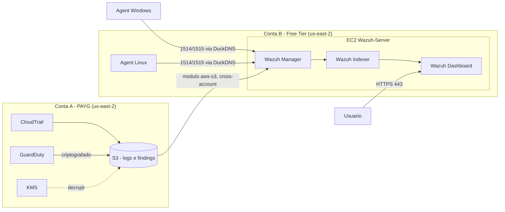

# Wazuh AWS SIEM

SIEM (Security Information and Event Management) com **Wazuh** na **AWS**, all-in-one (manager + indexer + dashboard numa única EC2), com CloudTrail e GuardDuty integrados via S3 — GuardDuty em setup **cross-account**.

Projeto de estudo/portfólio, parte da iniciativa **VV Cloud Security**.

📄 Passo a passo completo, com troubleshooting real: [`wazuh-deployment.md`](./wazuh-deployment.md).

## Índice

- [Destaques](#destaques)
- [Arquitetura](#arquitetura)
- [Integração AWS](#integracao-aws)
- [Provisionamento](#provisionamento)
- [Segurança aplicada](#seguranca)
- [Débitos técnicos conhecidos](#debitos)
- [Próximos passos](#proximos)

## Destaques

- 🛠️ **Deploy real, não só tutorial**: SIEM all-in-one funcional na AWS, do zero ao agent monitorando eventos.
- ☁️ **Duas integrações AWS de ponta a ponta**: CloudTrail e GuardDuty (este último **cross-account**) → S3 → Wazuh, ambas validadas com testes reais.
- 🔐 **Hardening aplicado**: TLS via Let's Encrypt, acesso restrito por IP, chaves `ed25519` por máquina, IAM roles em vez de credenciais estáticas, segredos fora do Git.
- 🧱 **IaC**: agent Linux provisionado via Terraform — primeiro recurso do projeto migrado para código.
- 🧾 **FinOps**: custo acompanhado via Cost Explorer + AWS Budgets, instância parada manualmente quando ociosa.
- 📚 **Troubleshooting documentado**: cada problema real registrado com causa raiz e correção — ver [`wazuh-deployment.md`](./wazuh-deployment.md).

## Arquitetura

Topologia **all-in-one** (sem cluster, sem alta disponibilidade) — escolha deliberada para focar em aprendizado, não produção.

```mermaid
flowchart LR
    subgraph AcctB["Conta B - Free Tier (us-east-2)"]
        subgraph WS["EC2 Wazuh-Server"]
            MGR[Wazuh Manager]
            IDX[Wazuh Indexer]
            DSH[Wazuh Dashboard]
        end
        AGL[Agent Linux]
    end

    subgraph AcctA["Conta A - PAYG (us-east-2)"]
        CT[CloudTrail]
        GD[GuardDuty]
        KMS[KMS]
        S3[(S3 - logs e findings)]
    end

    AGW[Agent Windows]
    USR[Usuario]

    AGW -- "1514/1515 via DuckDNS" --> MGR
    AGL -- "1514/1515 via DuckDNS" --> MGR
    MGR --> IDX --> DSH
    USR -- "HTTPS 443" --> DSH

    CT --> S3
    GD -- "criptografado" --> S3
    KMS -.decrypt.-> S3
    S3 -- "modulo aws-s3, cross-account" --> MGR
```

| Componente | Detalhe |
|---|---|
| EC2 Wazuh Server | Ubuntu, `m7i-flex.large`, EBS 50GB |
| EC2 Linux Agent | `t3.micro`, via Terraform |
| Acesso | Elastic IP + DuckDNS + TLS (Let's Encrypt) |
| Wazuh | v4.14.7 |

## Integração AWS

Módulo `aws-s3` do Wazuh Manager (polling a cada 3 minutos), com dois buckets configurados.

**CloudTrail → S3 → Wazuh**
- Trail multi-região, bucket `vv-wazuh-cloudtrail-logs`, na mesma conta do Wazuh Server.
- IAM Role `EC2-S3-ReadOnly-Access` anexada via instance profile — sem credenciais estáticas.
- Validado com teste real (criação/exclusão de bucket de teste): evento no dashboard em ~7-10 min. Regras nativas de compliance (GDPR, HIPAA, PCI-DSS, NIST) já cobrem os eventos.

**GuardDuty → S3 → Wazuh (cross-account)**
- GuardDuty, o bucket `vv-wazuh-guardduty-findingss` e a chave KMS ficam na **Conta A (PAYG)**; o Wazuh Server fica na **Conta B (Free Tier)** — ambas em `us-east-2`.
- Findings exportados criptografados via KMS; a bucket policy da Conta A libera leitura cross-account para a role `EC2-S3-ReadOnly-Access` da Conta B.
- Essa role tem duas policies: `AmazonS3ReadOnlyAccess` (leitura do S3) e `EC2-KMS-Decrypt-CrossAccount` (decrypt da chave KMS da Conta A).
- Validado com Sample Findings do GuardDuty — 10 arquivos `.jsonl.gz` confirmados via `aws s3 ls` na EC2 e consumidos pelo Wazuh.

<strong>Troubleshooting — módulo aws-s3</strong>

1. **Path duplicado (`AWSLogs/AWSLogs/`)**: causado por incluir a tag `<path>` manualmente na configuração do bucket, quando o parser nativo do tipo `cloudtrail` já monta o caminho completo sozinho. Correção: remover o `<path>` customizado.
2. **`AccessDenied`**: causado por uma policy customizada incompleta, sem a permissão `s3:ListBucket`. Correção: substituída pela policy gerenciada `AmazonS3ReadOnlyAccess`.

## Provisionamento

- **Wazuh Server**: manual, via console AWS + terminal (SSH/PowerShell) — hands-on primeiro, automação depois.
- **Agent Linux**: via **Terraform** (`terraform/`) — primeiro recurso do projeto migrado para IaC.

<strong>Terraform — detalhes</strong>

- `aws_instance.linux_agent` (`t3.micro`), `aws_security_group.agents_sg` dedicado, ingress SSH restrito por IP, egress liberado, `aws_key_pair.wazuh_agent_key` (`ed25519`).
- Provider `hashicorp/aws` v6.60.0, autenticação via AWS CLI profile — nenhuma credencial hardcoded.
- Segredos (`terraform.tfvars`, `*.tfstate`, `tfplan.out`) fora do Git via `.gitignore`.
- State local, sem backend remoto.

## Segurança aplicada

- ✅ Dashboard (443), streaming de eventos (1514) e enrollment de agents (1515) nunca expostos à internet — restritos por IP.
- ✅ SSH via chave `ed25519`, um par por máquina, sem autenticação por senha.
- ✅ Elastic IP sempre associado à instância ativa, evitando cobrança por IP ocioso.
- ✅ Credenciais em gerenciador de senhas, nunca deixadas só no output do terminal.
- ✅ Duas contas AWS standalone (free tier e PAYG), isoladas de outras Organizations.
- ✅ Acesso cross-account restrito a uma única role (`EC2-S3-ReadOnly-Access`), sem credenciais estáticas.
- ✅ Segredos do Terraform mantidos fora do controle de versão via `.gitignore`.

## Débitos técnicos conhecidos

- ⚠️ Wazuh Server ainda provisionado manualmente — apenas o agent Linux está em Terraform.
- ⚠️ Terraform state local, sem backend remoto (ex: S3 + DynamoDB lock).
- ⚠️ `AmazonS3ReadOnlyAccess` é mais ampla que o necessário — concede leitura a todos os buckets S3 da conta, não só aos dois do projeto.
- ⚠️ GuardDuty ativo desde o teste com Sample Findings — free trial de 30 dias gera custo depois; monitorar cobrança na Conta A.

## Próximos passos

- [x] CloudTrail → S3 → módulo `aws-s3` do Wazuh — validado com teste real
- [x] GuardDuty → S3 → módulo `aws-s3` do Wazuh, cross-account — validado com Sample Findings
- [ ] Regra de alerta customizada usando dados do CloudTrail/GuardDuty
- [x] Segundo agent (Linux, via Terraform) — status Active
- [ ] Migrar o Wazuh Server (EC2, SG, EIP) para Terraform
- [ ] Configurar backend remoto para o Terraform state (S3 + lock)
- [x] AWS Budgets — orçamento de US$25/mês, alertas em 50%, 80% e 100%
- [ ] Monitorar custo do GuardDuty após os 30 dias de trial gratuito

---

Projeto de estudo pessoal — não recomendado para uso em produção sem revisão adicional de hardening e alta disponibilidade.
