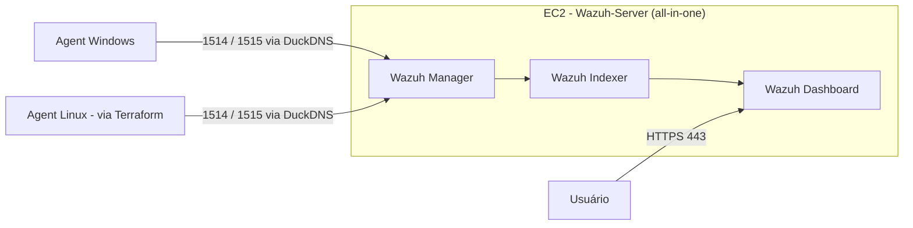

# Wazuh AWS SIEM — Registro de Deploy

Registro cronológico do deploy do Wazuh na AWS: problemas reais encontrados e como foram corrigidos. Visão geral do projeto: `README.md`. Contexto e convenções: `CLAUDE.md`.

## Índice

- [Arquitetura (diagrama)](#arquitetura)
- [1. Ambiente](#sec-1)
- [2. Instalação do Wazuh + disco cheio](#sec-2)
- [3. Elastic IP + certificado Let's Encrypt](#sec-3)
- [4. Agent Windows + troubleshooting](#sec-4)
- [5. Agent Linux via Terraform](#sec-5)
- [6. IP dinâmico quebrando SSH e keep-alive dos agents](#sec-6)
- [7. Limpeza de Security Groups órfãos + profile AWS CLI errado](#sec-7)
- [8. FinOps](#sec-8)
- [9. Checklist de estado atual](#sec-9)

<a id="arquitetura"></a>
## Arquitetura



<a id="sec-1"></a>
## 1. Ambiente

- **Instância**: `Wazuh-Server`, Ubuntu, `m7i-flex.large` (2 vCPU / 8GB RAM).
- **EBS (root)**: 50GB — expandido dos 8GB originais (insuficientes, ver seção 2).
- **Security Group**: `wazuh-sg` — portas 443, 22, 1514, 1515, todas restritas a IPs específicos, nunca `0.0.0.0/0`.
- **Domínio**: DuckDNS apontando para o Elastic IP. Nome real omitido por segurança.
- **Conta AWS**: standalone free tier, isolada de outras Organizations — nunca unir a uma Organization (perde o Free Plan).

<a id="sec-2"></a>
## 2. Instalação do Wazuh + disco cheio

Instalação all-in-one via `wazuh-install.sh`. Usar sempre o path versionado — `https://packages.wazuh.com/4.14/wazuh-install.sh`. O path genérico (`/4.x/`) retornou `AccessDenied`.

<details>
<summary><strong>Troubleshooting — disco cheio na instalação do wazuh-manager</strong></summary>

EBS root inicial (8GB) insuficiente para o all-in-one, causou disco cheio no meio da instalação. Correção:

1. Expandir o EBS via console (8GB → 50GB).
2. `growpart` + `resize2fs` para estender partição e filesystem.
3. Limpar o pacote quebrado: `dpkg --remove --force-remove-reinstreq wazuh-manager` + `rm -rf /var/ossec`.
4. Reinstalar com `wazuh-install.sh -a -o`.

Lição: provisionar 30-50GB de EBS desde a criação da instância.

</details>

<a id="sec-3"></a>
## 3. Elastic IP + certificado Let's Encrypt

Elastic IP alocado e sempre associado à instância ativa (evita cobrança por IP ocioso). Certificado TLS via **Let's Encrypt** (certbot standalone), válido até 12/11/2026, renovação automática.

<details>
<summary><strong>Troubleshooting — certificado não aplicava no dashboard</strong></summary>

Edição do `opensearch_dashboards.yml` via `nano` não persistia (causa não totalmente explicada). Corrigido editando via `sed` + `systemctl restart wazuh-dashboard`.

Verificar certificado ativo:
```
openssl s_client -connect localhost:443 -servername <dominio-duckdns> 2>/dev/null | openssl x509 -noout -issuer
```

</details>

<a id="sec-4"></a>
## 4. Agent Windows + troubleshooting

Primeiro agent registrado: máquina Windows pessoal, status **Active**.

**Error 1925 (privilégios insuficientes)**: `msiexec /q` falha silenciosamente se o PowerShell não estiver elevado — rodar como Administrador.

<details>
<summary><strong>Troubleshooting — agent preso em "Never connected"</strong></summary>

A ordem de liberação das portas no `wazuh-sg` importa: 1515 (enrollment) precisa estar liberada primeiro para completar o registro; só depois 1514 (streaming) é necessária para o agent passar a "Active".

</details>

<a id="sec-5"></a>
## 5. Agent Linux via Terraform (primeiro uso de IaC no projeto)

Segunda EC2 (`linux_agent`, `t3.micro`, Ubuntu) via Terraform — primeiro recurso do projeto migrado para IaC, introduzido só depois do fluxo manual do Wazuh Server já validado.

**IAM**: usuário `Terraform` (via conta root) + grupo `Terraform-Automation-Group`, separados do usuário/grupo do dia a dia (`Victor-Deployer`/`Deployers-Group`, sem permissão de IAM por design). Policy exata anexada ao grupo ainda **não confirmada**.

**Recursos** (`terraform/`): `aws_instance.linux_agent`, `aws_security_group.agents_sg` (dedicado, separado do `wazuh-sg`), ingress SSH restrito a `var.personal_ip`, egress liberado, `aws_key_pair.wazuh_agent_key` (`ed25519`). Regra `ssh_professional` comentada em `main.tf`, ativar junto com `professional_ip` quando necessário.

Segredos (`terraform.tfvars`, `*.tfstate`, `.terraform/`, `tfplan.out`) fora do Git via `.gitignore`. State local, sem backend remoto.

Agent Wazuh instalado (`.deb`, Ubuntu) apontando pro manager via DuckDNS, registrado como `Linux-Agent`. Status: **Active**.

<details>
<summary><strong>Troubleshooting — pacote RPM errado</strong></summary>

O assistente "Deploy new agent" do dashboard sugeriu `.rpm`, mas a instância é Ubuntu — precisa de `.deb`. Corrigido instalando o pacote certo via `dpkg -i`.

</details>

<details>
<summary><strong>Troubleshooting — destroy acidental</strong></summary>

Um `terraform destroy` foi rodado sem intenção, removendo os 5 recursos gerenciados. Detectado via `terraform state list` vazio. Recuperado com `terraform plan` + `apply` — o Terraform reconstruiu tudo a partir do código, sem mudanças.

</details>

<a id="sec-6"></a>
## 6. IP dinâmico quebrando SSH e keep-alive dos agents

IP público residencial mudou; as regras do `wazuh-sg` (22, 1514, 1515), restritas ao IP antigo por `/32`, pararam de aceitar conexão.

**Sintomas**: `ssh Wazuh-Server` com `Connection timed out`; agent Windows como **Disconnected** no dashboard.

**Correção** (manual): `curl https://checkip.amazonaws.com` para pegar o IP atual → atualizar as 3 regras no `wazuh-sg` via console. Ainda é um passo manual, repetido a cada troca de IP.

<a id="sec-7"></a>
## 7. Limpeza de Security Groups órfãos + profile AWS CLI errado

**SGs órfãos**: 4 SGs sem relação com o projeto removidos, incluindo `efs-sg-1` (confirmado vazio via `aws efs describe-file-systems` e `aws ec2 describe-network-interfaces`). Provável sobra de testes anteriores.

**Profile AWS CLI errado**: comandos rodados sem `--profile` caíram no profile `default` (conta de management de outra Organization, não a conta do projeto) — resultados vazios enganosos, parecendo confirmar SGs sem uso quando na verdade a consulta era na conta errada. Corrigido especificando `--profile Terraform`.

Lição: sempre confirmar o profile ativo (`aws sts get-caller-identity --profile <nome>`) antes de interpretar um retorno vazio como "não existe" — pode ser "não existe **nesta conta**".

<a id="sec-8"></a>
## 8. FinOps

Custo verificado via **AWS Cost Explorer**: EC2 Compute em ~**$28,53**/mês, ~**82%** do custo total da conta. Prática adotada: parar a instância manualmente quando ociosa (já aplicada, não só planejada). Automação de start/stop (ex.: EventBridge Scheduler) ainda em backlog.

<a id="sec-9"></a>
## 9. Checklist de estado atual

| Componente | Estado |
|---|---|
| Wazuh Server (EC2 all-in-one) | ✅ Ativo, provisionado manualmente |
| Elastic IP | ✅ Alocado e associado |
| Certificado TLS (Let's Encrypt) | ✅ Válido até 12/11/2026, renovação automática |
| Agent Windows | ✅ Registrado, status Active |
| Agent Linux (EC2 via Terraform) | ✅ Instância, SG e agent registrados (`Linux-Agent`), status Active |
| Terraform state | ⚠️ Local, sem backend remoto |
| Usuário/grupo IAM Terraform | ⚠️ Criados; policy exata anexada — a confirmar |
| SGs órfãos | ✅ Limpos (4 removidos) |
| Billing/FinOps | ✅ Cost Explorer verificado; parada manual de instância ociosa; AWS Budget de US$25/mês com alertas em 50/80/100%; start/stop automático ainda em backlog |
