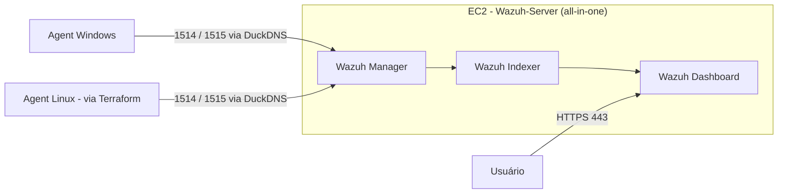

# Wazuh AWS SIEM — Registro de Deploy

Registro técnico do deploy do laboratório Wazuh na AWS, em ordem cronológica, incluindo os problemas encontrados e como foram resolvidos. Serve como referência para reproduzir o ambiente ou entender decisões tomadas no caminho. Visão geral do projeto está no `README.md`; contexto e convenções de trabalho, no `CLAUDE.md`.

## Índice

- [Arquitetura (diagrama)](#arquitetura)
- [1. Ambiente](#sec-1)
- [2. Instalação do Wazuh + disco cheio](#sec-2)
- [3. Elastic IP + certificado Let's Encrypt](#sec-3)
- [4. Agent Windows + troubleshooting](#sec-4)
- [5. Agent Linux via Terraform](#sec-5)
- [6. IP dinâmico quebrando SSH e keep-alive dos agents](#sec-6)
- [7. Limpeza de Security Groups órfãos + profile AWS CLI errado](#sec-7)
- [8. FinOps](#sec-8)
- [9. Checklist de estado atual](#sec-9)

<a id="arquitetura"></a>
## Arquitetura



<a id="sec-1"></a>
## 1. Ambiente

- **Instância EC2**: `Wazuh-Server`, Ubuntu, `m7i-flex.large` (2 vCPU / 8GB RAM).
- **Volume EBS (root)**: 50GB — expandido a partir dos 8GB originais (ver seção 2, o volume inicial não comportou a instalação all-in-one).
- **Security Group**: `wazuh-sg`, com portas 443 (dashboard), 22 (SSH), 1514 (streaming de eventos) e 1515 (enrollment de agents), todas restritas a IPs específicos — nunca `0.0.0.0/0`.
- **Domínio**: DuckDNS (DNS dinâmico gratuito), apontando para o Elastic IP da instância. Nome real omitido deste documento por segurança.
- **Conta AWS**: standalone, free tier, isolada de outras Organizations do usuário — nunca deve ser unida a uma Organization (perderia o Free Plan).

<a id="sec-2"></a>
## 2. Instalação do Wazuh + disco cheio

Instalação all-in-one (manager + indexer + dashboard na mesma instância) via `wazuh-install.sh`.

**Path do instalador**: `https://packages.wazuh.com/4.x/wazuh-install.sh` retornou `AccessDenied` em uma tentativa. O path versionado, `https://packages.wazuh.com/4.14/wazuh-install.sh`, funcionou de forma consistente — preferir sempre a versão explícita.

<details>
<summary><strong>Troubleshooting — disco cheio na instalação do wazuh-manager</strong></summary>

O volume EBS root inicial (8GB) se mostrou insuficiente para a instalação all-in-one, causando disco cheio no meio da instalação do `wazuh-manager`. Resolução:

1. Expandir o volume EBS via console AWS (8GB → 50GB).
2. No SO: `growpart` para estender a partição, seguido de `resize2fs` para estender o filesystem.
3. Limpar o pacote quebrado deixado pela instalação falha:
   ```
   dpkg --remove --force-remove-reinstreq wazuh-manager
   rm -rf /var/ossec
   ```
4. Reinstalar com `wazuh-install.sh -a -o` (o offset `-o` reaproveita/pula etapas já concluídas).

Lição: sempre provisionar 30-50GB de EBS desde a criação da instância para instalação all-in-one.

</details>

<a id="sec-3"></a>
## 3. Elastic IP + certificado Let's Encrypt

- Elastic IP alocado e associado à instância `Wazuh-Server`, mantido sempre associado à instância ativa para evitar cobrança por IP ocioso.
- Certificado TLS via **Let's Encrypt** (certbot, modo standalone), válido até 12/11/2026, com renovação automática configurada.

<details>
<summary><strong>Troubleshooting — certificado não aplicava no dashboard</strong></summary>

Após emitir o certificado, o Wazuh Dashboard continuava servindo o certificado antigo/self-signed. A causa era edição do `opensearch_dashboards.yml` via `nano`, que não estava persistindo as mudanças (comportamento não totalmente explicado — suspeita de erro de salvamento/permissão no editor). Corrigido editando o arquivo diretamente via `sed`, seguido de:

```
systemctl restart wazuh-dashboard
```

Verificação do certificado ativo:

```
openssl s_client -connect localhost:443 -servername <dominio-duckdns> 2>/dev/null | openssl x509 -noout -issuer
```

</details>

<a id="sec-4"></a>
## 4. Agent Windows + troubleshooting

Primeiro agent registrado no manager: máquina Windows pessoal, status atual **Active**.

**Troubleshooting — Error 1925 (privilégios insuficientes)**

A instalação via `msiexec /q` falhava silenciosamente com Error 1925 quando o PowerShell não estava rodando elevado. Corrigido reabrindo o PowerShell como Administrador ("Executar como administrador") antes de rodar o instalador.

<details>
<summary><strong>Troubleshooting — agent preso em "Never connected"</strong></summary>

O agent completava o registro mas nunca saía do status "Never connected" no dashboard. Causa: a ordem de liberação das portas no `wazuh-sg` importa — a porta 1515 (enrollment) precisa estar liberada primeiro para completar o registro do agent; só depois a porta 1514 (streaming de eventos) é necessária para o agent passar a "Active". Liberar as duas portas fora dessa ordem, ou só uma delas, deixa o agent parado em "Never connected".

</details>

<a id="sec-5"></a>
## 5. Agent Linux via Terraform (primeiro uso de IaC no projeto)

Segunda instância EC2 (`linux_agent`, `t3.micro`, Ubuntu), provisionada via Terraform — primeiro recurso do projeto migrado de provisionamento manual para IaC. Introduzido só depois que o fluxo manual do Wazuh Server já estava validado e estável.

### IAM

- Usuário IAM dedicado `Terraform` criado via conta root, porque o usuário usado no dia a dia (`Victor-Deployer`, com `PowerUserAccess`) não tem permissão de IAM por design (least privilege).
- Grupo dedicado `Terraform-Automation-Group`, separado do `Deployers-Group`.
- **Policy exata anexada ao grupo ainda não confirmada** (pode ser uma policy customizada mínima de EC2/SG, ou `AmazonEC2FullAccess`) — **a confirmar**, não presumir.

### Recursos Terraform

Localizados em `terraform/` na raiz do projeto:

- `aws_instance.linux_agent` — EC2 `t3.micro`, AMI Ubuntu.
- `aws_security_group.agents_sg` — SG dedicado ao agent, separado do `wazuh-sg` do Wazuh Server.
- `aws_vpc_security_group_ingress_rule.ssh_personal` — libera 22/tcp apenas para `var.personal_ip`.
- `aws_vpc_security_group_egress_rule.allow_all_outbound` — egress liberado (`0.0.0.0/0`).
- `aws_key_pair.wazuh_agent_key` — chave pública `ed25519` dedicada ao agent.
- Regra `ssh_professional` está comentada em `main.tf`, para ativar quando necessário junto com a var `professional_ip` (hoje vazia em `terraform.tfvars`).

**Convenções**: nomes de recursos em `snake_case`; `terraform.tfvars` (com `personal_ip`, `professional_ip`, `public_key_path`) fora do controle de versão via `.gitignore`, assim como `*.tfstate`/`*.tfstate.backup`, `.terraform/` e `tfplan.out` (o binário do plan embute os valores das variáveis, incluindo IP pessoal — não coberto pelo padrão genérico `*.tfplan`).

**State**: local (`terraform.tfstate` na própria pasta `terraform/`), sem backend remoto — sem locking, risco de perda se o arquivo sumir.

### Instalação do agent Wazuh na instância

Com a instância e o SG provisionados via Terraform, o pacote `wazuh-agent` (`.deb`, Ubuntu) foi instalado apontando para o manager via domínio DuckDNS (mesmo domínio usado no restante do projeto — ver seção 1). Agent registrado com o nome `Linux-Agent`; serviço habilitado e iniciado via `systemctl`. Status atual: **Active**, mesmo `node01` e versão (v4.14.7) do agent Windows.

<details>
<summary><strong>Troubleshooting — pacote RPM errado</strong></summary>

O assistente "Deploy new agent" do próprio dashboard Wazuh gerou um comando de instalação `.rpm` (`rpm -ihv ...`), mas a instância provisionada é Ubuntu, que precisa do pacote `.deb`. O erro aconteceu porque o comando sugerido foi copiado sem antes confirmar a distribuição selecionada no wizard. Corrigido trocando manualmente para o pacote `.deb` equivalente, instalado via `dpkg -i`.

</details>

<details>
<summary><strong>Troubleshooting — destroy acidental</strong></summary>

Em uma sessão anterior, um `terraform destroy` foi executado sem essa intenção, removendo os 5 recursos gerenciados (instância, SG, as 2 regras de ingress/egress, e o key pair). Detectado ao rodar `terraform state list` e receber retorno vazio. Recuperado normalmente com `terraform plan` + `terraform apply`, recriando os mesmos 5 recursos sem nenhuma mudança no código — o Terraform reconstruiu o estado a partir da definição declarativa existente.

</details>

<a id="sec-6"></a>
## 6. IP dinâmico quebrando SSH e keep-alive dos agents

O IP público residencial mudou, e as regras do `wazuh-sg` (portas 22, 1514 e 1515), restritas ao IP antigo por `/32`, pararam de aceitar conexão.

**Sintomas**:
- `ssh Wazuh-Server` retornando `Connection timed out`.
- O agent Windows aparecendo como **Disconnected** no dashboard (keep-alive parado), notado ao checar o dashboard depois do timeout de SSH.

**Correção** (manual, sem automação ainda):
1. Obter o IP público atual: `curl https://checkip.amazonaws.com`.
2. Atualizar as 3 regras (22, 1514, 1515) no `wazuh-sg` via console AWS.

Esse é hoje um passo manual — repetido sempre que o IP residencial muda.

<a id="sec-7"></a>
## 7. Limpeza de Security Groups órfãos + profile AWS CLI errado

**SGs órfãos**: 4 Security Groups sem nome/sem relação com o projeto foram identificados e removidos, incluindo um `efs-sg-1` sem EFS ou network interface associados — confirmado via `aws efs describe-file-systems` e `aws ec2 describe-network-interfaces`, ambos retornando vazio. Provavelmente sobras de testes anteriores não documentados (não SGs default de VPC). Remoção feita via console; uma primeira tentativa falhou com erro de "associated", resolvida ao confirmar que era cache desatualizado do console (o SG já não tinha nada de fato associado).

**Erro de profile AWS CLI**: durante a investigação dos SGs órfãos, comandos AWS CLI foram rodados sem `--profile` explícito, caindo no profile `default` — que aponta para uma conta diferente (conta de management de outra Organization do usuário), não a conta standalone onde o projeto Wazuh está. Sintoma: os comandos (`describe-network-interfaces`, `efs describe-file-systems`) retornaram vazio de forma enganosa, parecendo confirmar que os SGs não tinham nada associado, quando na verdade a consulta estava sendo feita na conta errada. Corrigido especificando `--profile Terraform` explicitamente em todos os comandos.

**Lição**: sempre confirmar o profile ativo (`aws sts get-caller-identity --profile <nome>`) antes de interpretar um retorno vazio como "não existe" — pode ser "não existe **nesta conta**".

<a id="sec-8"></a>
## 8. FinOps

Custo verificado via **AWS Cost Explorer** (console de Billing and Cost Management, não o dashboard de free tier): EC2 Compute em aproximadamente **$28,53** no mês corrente, cerca de **82%** do custo total da conta.

**Prática adotada**: parar a instância `Wazuh-Server` manualmente quando ociosa — já aplicada pelo menos uma vez durante o projeto, não apenas planejada.

**Backlog**: automação do start/stop (ex: EventBridge Scheduler) foi discutida, mas ainda não implementada.

<a id="sec-9"></a>
## 9. Checklist de estado atual

| Componente | Estado |
|---|---|
| Wazuh Server (EC2 all-in-one) | ✅ Ativo, provisionado manualmente |
| Elastic IP | ✅ Alocado e associado |
| Certificado TLS (Let's Encrypt) | ✅ Válido até 12/11/2026, renovação automática |
| Agent Windows | ✅ Registrado, status Active |
| Agent Linux (EC2 via Terraform) | ✅ Instância e SG provisionados; agent Wazuh instalado e registrado (`Linux-Agent`), status Active |
| Terraform state | ⚠️ Local, sem backend remoto |
| Usuário/grupo IAM Terraform | ⚠️ Criados; policy exata anexada — a confirmar |
| SGs órfãos | ✅ Limpos (4 removidos) |
| Billing/FinOps | ⚠️ Cost Explorer verificado; parada manual de instância ociosa como prática adotada; automação em backlog |

### Próximos passos

- [ ] Confirmar e documentar a policy IAM exata anexada ao grupo `Terraform-Automation-Group`
- [ ] Integração AWS: GuardDuty + CloudTrail → S3 → módulo `aws-s3` do Wazuh (requer IAM Role dedicada com leitura restrita aos buckets)
- [ ] Regras de alerta customizadas no dashboard
- [ ] Migrar o Wazuh Server (EC2, `wazuh-sg`, EIP) para Terraform, usando o padrão do agent Linux como base
- [ ] Configurar backend remoto para o Terraform state (S3 + DynamoDB lock)
- [ ] AWS Budgets / billing alarm, já que a conta é free tier
- [ ] Automatizar atualização das regras de SG quando o IP dinâmico mudar (ex: script ou Lambda consultando `checkip.amazonaws.com`)
- [ ] Automatizar start/stop da instância ociosa (ex: EventBridge Scheduler)
